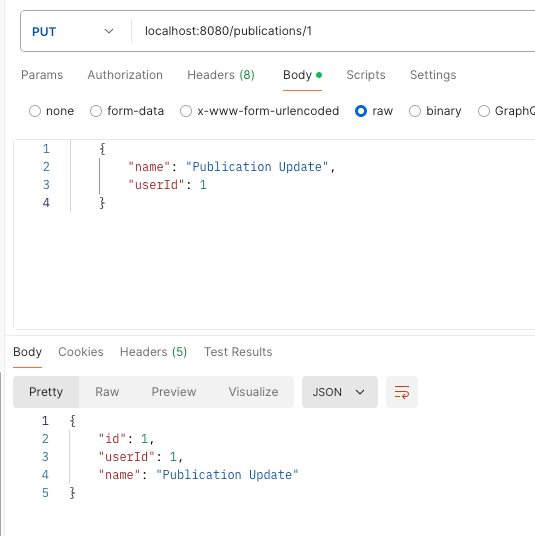

#Practica JPA SpringFramawork

Captura de micro subiendo

Se adjunta el archivo JpaComments.postman_collection.json con la coleccion de postman del consumo del micro

Pruebas de consumo Usuarios

Crear Usuario

Update Usuario

Consulta usuarios

Consulta Usuario por id

Eliminar Usuario

Pruebas de consumo Publicaciones

Crear Publicacion

Update Publicacion

Consulta Publicaciones

Consulta Publicacion por id

Consultar Publicacion por userId

Eliminar Publicacion

Pruebas de consumo Comentarios

Crear Comentario

Update Comentario

Consulta Comentarios

Consulta Comentario por id

Consultar Comentario por publicationId}

Eliminar Comentarios

